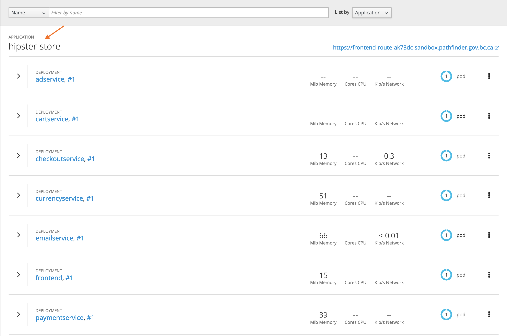
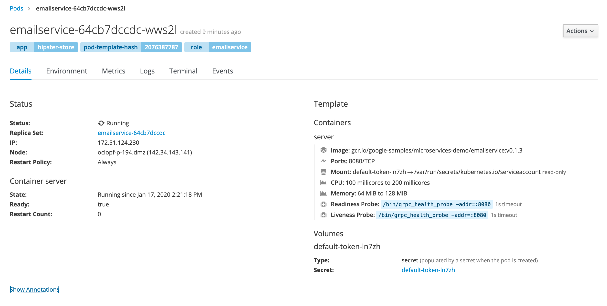
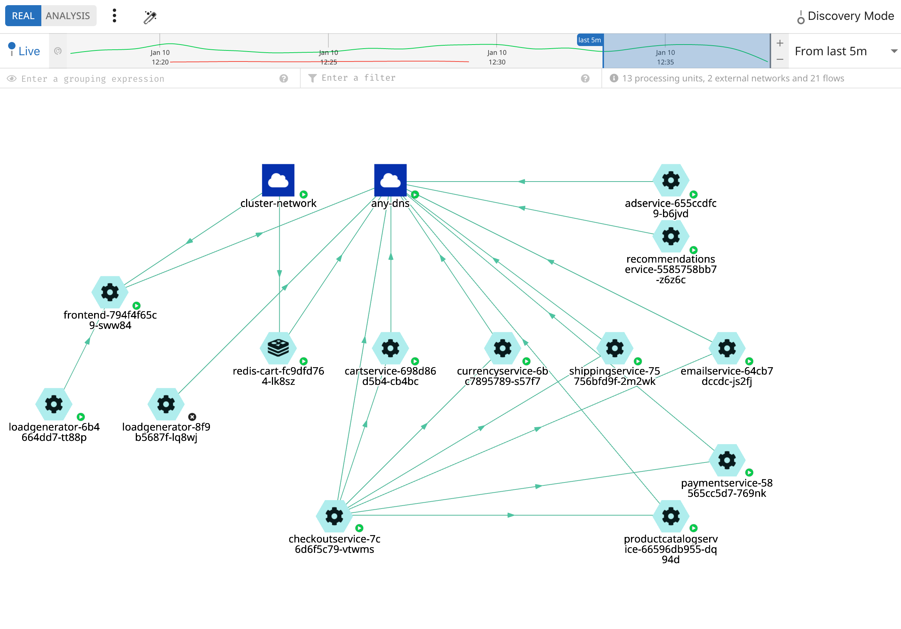

# TL;DR

Check out the manifests in `openshift/`. There you'll find one to deploy the Hipster Store demo application and the associated Network Security Policy (NSP) to make it work.

# Introduction

This project was created to show off some best practices for labeling your application, components, routes, and network security policy. Labeling is is key to both a healthy easy to manage application as well as implementing meaningful custom NSP.

The Hipster Store (HS) is a sample project created by Google to illustrate a microservices architecture designed to run on [Kubernetes](Kubernetes.io) (k8s). The HS makes for a great teaching application for Aporeto for a few reasons: its has lots of components with specific communication paths; its a working application; and its well documented.

As part of this demo project the HS application was converted to work on OCP and custom NSP was created to only allow components talk to the other components required to preform their job according to the [Service Architecture](https://github.com/GoogleCloudPlatform/microservices-demo#service-architecture). 

# Labels

Labels serve many purposes in the OpenShift Container Platform (OCP). Applying labels to pods or routes behavior can be assign or changed. In our case, labels are used to create an identity for the HS application, as a whole, as well as its constituent component.

# Application Identity

Build the identity of our application and components by applying labels at different levels:

The first label is attributed to the `Deployment` section of each component in our [app.yaml](openshift/app.yaml) manifest. By inserting the label `app: hipster-store` at this level we group all the components into a single application visible in the OCP Web console.

```yaml
- apiVersion: apps/v1
  kind: Deployment
  metadata:
    name: emailservice
    labels:
      app: hipster-store
  spec:
```

This results in all of the components grouped within OCP as seen by the following web console screen-shot:



The second label is attributed to the `template` section of the manifest. This unique label is applied to the running Pod and it the secret sauce in our identity. 

```yaml
template:
  metadata:
  labels:
    app: hipster-store
    role: emailservice
```

This results in unique identifying a component by its role within OCP as seen by the following web console screen-shot.



**ProTip 🤓**

Pods are also called Processing Units (PU) in Aporeto parlance; notice how the PU inheres the `app: hipster-store` label from its deployment config. You can use this in NSP to reference all components.

# The Laboratory

TBD. This section will run people through a lab based on a bootstrap deployment.

<!-- Notes

- Adding `- - $namespace=${NAMESPACE}` to both source and destination is important because, in theory, on OCP4 someone
could create a pod with matching labels that can talk to other
peoples pods.
- You get pod crashes if, when they start, they can't talk to one another.
- The app does not seem to recover after policy is added. Need to re-deploy the application. -->

# Run & Go

This sections is meant for to deploy-and-go. You won't learn much doing this other that have a working sample application you can review. The following steps (commands) will deploy the following components:

1. Hipster Store Application
2. Custom Policy
3. Load Generate

## Deploy It

### Step 1: Pre-Flight Check

Before you deploy this application you should remove any existing policy created automatically or otherwise. To check if you have any existing policy run the following command:

```console
oc get nsp
```

On OCP4 there are no default policies, however, on OCP 3.11 you may see these three policies. If you do, they need to be deleted:

```console
NAME                        AGE
egress-internet             6m
int-cluster-k8s-api-comms   6m
intra-namespace-comms       6m
```

Delete them with the following command:

```console
oc delete nsp egress-internet int-cluster-k8s-api-comms intra-namespace-comms
```

### Step 2: Deploy the Security Policy

In order for PUs to deploy they need to be able to communicate with the k8s API. We'll go ahead and deploy our NSP first because it contains the policy to allow this to happen. We could deploy the applications first but we'll see lots of `CrashLoopBackOff` messages as PU's health checks and k8s API communications fail.

```console
oc process -f openshift/app-netpol.yaml \
  -p NAMESPACE=$(oc project --short=true) \
  | oc apply -f -
```

As mentioned above this allows PUs to communicate acording to the [Service Architecture](https://github.com/GoogleCloudPlatform/microservices-demo#service-architecture).


**ProTip 🤓**

The `NAMESPACE` parameter is required because your policy will be applied to an Aporeto namespace that matches your OCP namespace. It will signal to Aporeto the scope of your policy.

### Step 3: Deploy the Application

Now deploy the application and components. This will spin up several pods and create a route you can use to test the application.

```console
oc process -f openshift/app.yaml| oc apply -f -
```

Wait for all the pods to start; they will have a "READY" count of `1/1` as shown by the command `oc get pods`. Once all pods have `1/1` in the READY state you can test the application by loading the route in your browser.

### Step 4: Deploy the Load Generator

The HS comes with a sample load generator. This is great for debugging NSP because it will generate traffic across all the components. The `loadgen.yaml` manifest contains its own NSP which is why the `NAMESPACE` parameter is required.

```console
oc process -f openshift/loadgen.yaml \
  -p NAMESPACE=$(oc project --short=true) | \
  oc apply -f -
```

You can now access your namespace via the Aporeto console and see the communication paths of the components. Green arrows mean all is well; orange mean something was not working but is now fixed; red indicates communication is failing. The direction of the arrow shows source to destination.



## Cleanup

Use the label `app=hipster-store` to cleanup all deployments, pods, routes and NSP associated with the HS in one easy step:

```console
oc delete all,nsp -l "app=hipster-store"
```

# Contributing

This project is released with a [Contributor Code of Conduct](CODE_OF_CONDUCT.md). By participating in this project you agree to abide by its terms.

# References

Find the original Hipster Store [here](https://github.com/GoogleCloudPlatform/microservices-demo) on GitHub.

The Hipster Store Service Architecture, which defines the communication patterns of the application, can be found [here](https://github.com/GoogleCloudPlatform/microservices-demo#service-architecture).

Much of the application deployment manifests are taken directly from the k8s manifests supplied by Google. That source is Copyright 2018 Google LLC.
